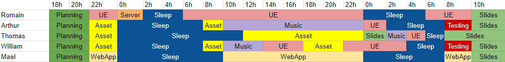
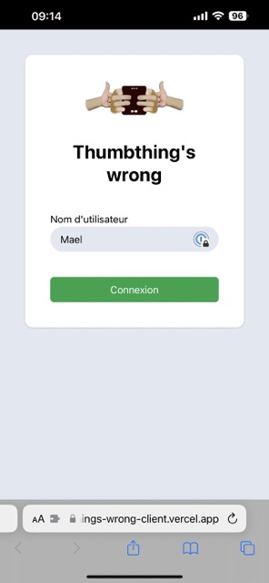
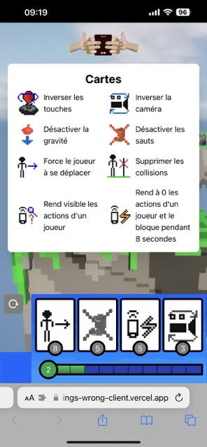

<h1 align="center">Thumthing's wrong</h1>
<h4 align="center">Video Game</h4>

   
   
   
    

---

### Quick Reminder

This project was created during a 38-hour game jam. As a result, the code may not be optimized or clean, and may contain errors or bugs.

## Description

Thumbthing's Wrong" is a fast-paced and thrilling 3D platformer game developed in a game jam. The game is designed to be played in a multiplayer format, where the main player controls a character that needs to complete the level within a limited time frame. However, other players, who join in from their phone, play the role of rule-breakers, with the ability to modify the game environment, including changing gravity, collision, controls, and camera angles. The goal of these players varies depending on their role, where some aim to assist the main player while others try to waste their time and prevent them from reaching the finish line.

## Team

- [**Thomas Delapart**](https://github.com/Thomega35) (Asset Designer, Sound Designer)
- [**William Van Haelst**](https://github.com/AlcladZ) (Asset Designer, Level Designer)
- [**Mael Kerichard**](https://github.com/Pixselve) (Web App Developper)
- [**Arthur Allain**](https://github.com/Pataubeur) (Asset Designer, Music Maker)
- [**Romain Briend**](https://github.com/yami2200) (Project Manager, Game Developper)

### Work repartition

## WebApp

The link to the webapp repository : [**Click Here**](https://github.com/Pixselve/thumbthings-wrong-client)

